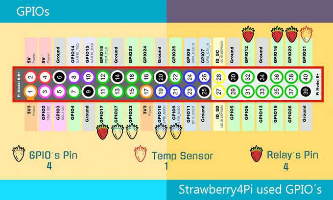

The strawberry4pi is a "hat" for the Raspberry Pi with 4 250v 10A relays, a 1-wire temperature sensor and a button. It also has a couple of LEDs and a "5v In-Out Connection".

This was originally designed to function using a proprietary custom build of Raspbian and a companion mobile app. However the iOS app doesn't appear to be available anymore and if you don't want to run their now 2 year old custom build of Raspbian there is almost no information available.

As I figure out how to use this board from a normal Linux installation (Arch Linux ARM but should work the same with Ubuntu or Raspbian) I will document it here.

## Manual PDF

There is a manual PDF buried inside their portal which I've uploaded [here](./manual.pdf)

## Temperature sensor

The sensor appears to use the 1-wire protocol on GPIO PIN 21. If you edit your `/boot/config.txt` and add a line with `dtoverlay=w1-gpio,gpiopin=21' this will make the ambient temperature available at a path such as `/sys/bus/w1/devices/w1_bus_master1/28-00000bf5368c/temperature`.
